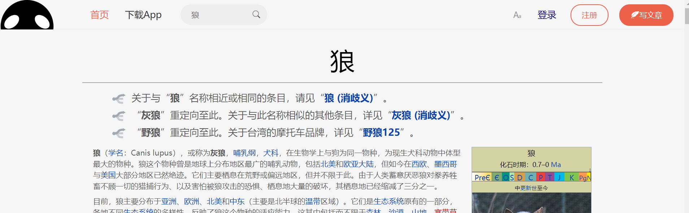

## React UI仿简书 功能仿Wiki 的 Demo

 

### 使用的技术

* styled-components
* axios
* immutable
* redux
* redux-thunk
* antd
* react-router-dom

基本样式如下

 

   
这个demo适用于多数网站的开发模式，运用react-router，分别进行了声明式路由/编程式路由
调用Wiki的api返回Wiki百科内容，可以进行中文词条的搜索
通过这个小demo很好的巩固了react的知识，也收获了很多新的知识

//TODO

* 首页右边栏的美化
* 搜索内容不存在时返回一个错误页面而不是报错
* 首页列表可以返回随机数据
* 搜索下拉的内容也可以进行路由
* 搜索历史记录
